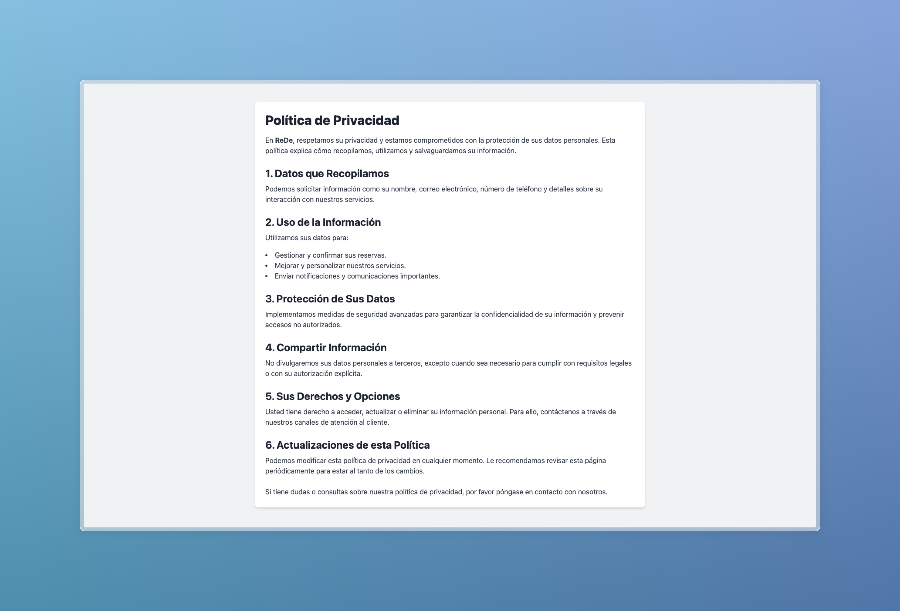

   
   

# ReDe - Reservas Deportivas para Villanueva de las Cruces

Bienvenido a **ReDe**, tu aplicación para gestionar reservas deportivas de manera eficiente y accesible desde cualquier dispositivo. Este documento te guiará a través de las funcionalidades y características principales de la aplicación.

---

# Índice

1. [Página Principal](#1-página-principal)
2. [Barra Superior](#2-barra-superior)
    1. [Inicio de Sesión/Cerrar Sesión](#21-inicio-de-sesióncerrar-sesión)
    2. [Reservas](#22-reservas)
    3. [Contacto](#23-contacto)
    4. [Panel de Administrador (Solo Admin)](#24-panel-de-administrador-solo-admin)
3. [Otros Elementos](#3-otros-elementos)
    1. [Sobre Nosotros](#31-sobre-nosotros)
    2. [Política de Privacidad](#32-política-de-privacidad)
4. [Instrucciones Básicas de Uso](#instrucciones-básicas-de-uso)

---

## 1. Página Principal

La página principal de ReDe te da la bienvenida con una interfaz clara y moderna. Desde aquí podrás explorar las distintas secciones de la aplicación mediante la barra de navegación superior y consultar otros elementos informativos en la barra inferior. Si no has iniciado sesión, se mostrará un botón para iniciar sesión.

También conforme bajas en la web, podrás ver una serie de vídeos introductorios con las funciones principales.

   
   
   

---

## 2. Barra Superior

La barra superior es el elemento de navegación principal y se encuentra visible en todas las páginas. Proporciona enlaces directos a las secciones más importantes:

### 2.1. Inicio de Sesión/Cerrar Sesión

- **Inicio de Sesión**: Si no estás autenticado, verás un botón que te permitirá iniciar sesión. Al hacer clic, serás dirigido a una página donde podrás ingresar tus credenciales o registrarte como un nuevo usuario.
- **Cerrar Sesión**: Una vez que hayas iniciado sesión, el botón cambiará a "Cerrar Sesión", lo que te permitirá salir de tu cuenta de manera segura.

### 2.2. Reservas

- Al iniciar sesión, el enlace 'Reservas' dirige a la sección de gestión de reservas.
- Aquí podrás:
   - **Ver tus reservas activas**: Muestra todas las reservas actuales organizadas de manera visual.
   - **Crear una nueva reserva**: Selecciona un espacio deportivo, elige una fecha y hora de inicio, y automáticamente se establecerá una duración de una hora.
   - **Modificar o eliminar reservas existentes**: Gestiona tus reservas de forma intuitiva con botones de acción.

### 2.3. Contacto

El enlace "Contacto" te permite comunicarte con nuestro equipo de soporte. Desde esta página, puedes enviarnos tus consultas o reportar problemas. Nuestro equipo estará encantado de ayudarte.

### 2.4. Panel de Administrador

- Este enlace aparece únicamente para los usuarios con privilegios de administrador.
- Desde el **Panel de Administrador**, puedes gestionar usuarios, reservas, y realizar ajustes avanzados en la aplicación.

---

## 3. Otros Elementos

En la parte inferior de la página web encontrarás otra barra con enlaces a elementos informativos adicionales, aparte de otra mención al formulario de contacto para que sea fácil solventar todos los problemas que puedan surgirle a los usuarios.

### 3.1. Sobre Nosotros

   
   

En esta sección encontrarás información sobre el equipo de desarrollo detrás de ReDe. Esta sección incluye una breve descripción y una imagen de cada miembro del equipo.

### 3.2. Política de Privacidad

La política de privacidad detalla cómo gestionamos los datos que se recopilan en la aplicación, asegurando la seguridad y confidencialidad de la información de los usuarios.

---

## Instrucciones Básicas de Uso

1. **Inicio de Sesión**: Ingresa tus credenciales para acceder a todas las funcionalidades de la aplicación.
2. **Gestión de Reservas**:
    - Navega a la sección de reservas.
    - Para crear una nueva reserva, selecciona el espacio y elige una fecha y hora de inicio.
    - Modifica o elimina reservas existentes según sea necesario.
3. **Contacto**: Envíanos tus consultas o reporta problemas desde la sección de contacto.

---

ReDe es tu solución completa para la gestión de reservas deportivas. ¡Gracias por confiar en nosotros!